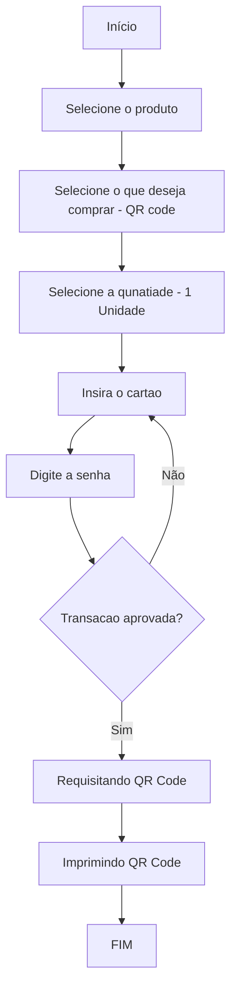
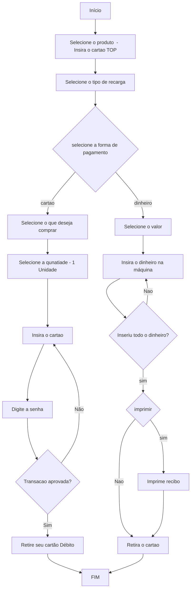
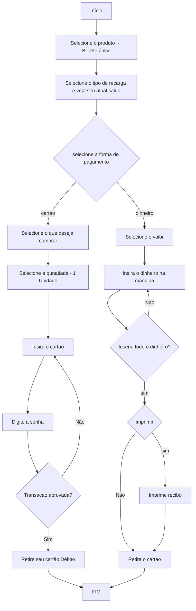
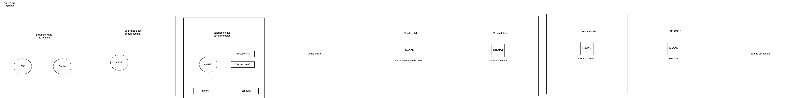
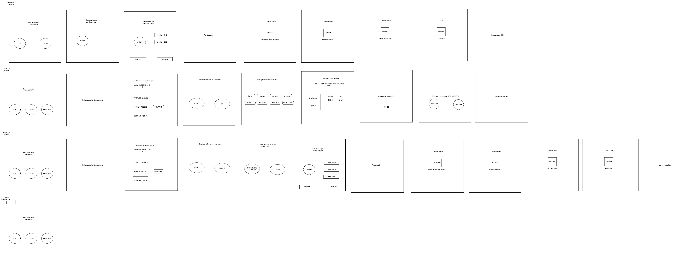
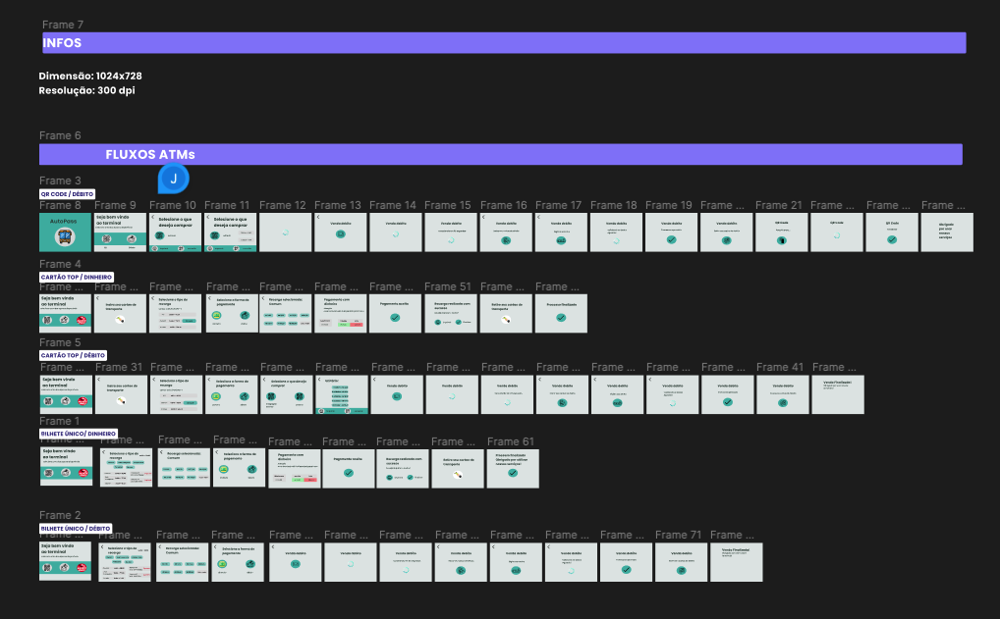
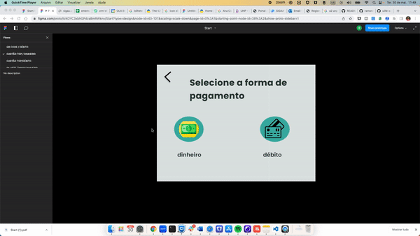

# Projeto Autopass 

# Sobre o Projeto

Projeto desenvolvido para a ATIVIDADE 3 da disciplina Usabilidade, Desenvolvimento Web, Mobile e Jogos.

<h4 align="center"> 
</h4>

# Índice/Sumário

- [Sobre](#sobre-o-projeto)
- [Sumário](#índice/sumário)
- [Entregaveis](#Entregaveis)
- [Fluxogramas](#fluxo-de-usuário)
- [Descrição das personas](#descrição-das-personas)
- [Descrição dos cenários](#descrição-dos-cenários)
- [Wireframe estático](#wireframe-estático)
- [Protótipo Interativo](#protótipo-interativo)
- [Relatório analítico das heurísticas de Nielsen](#relatório-analítico-das-heurísticas-de-nielsen)
- [Implementação](#implementação-das-telas-do-protótipo-desenvolvido)
- [Video Apresentação](#vídeo-apresentando-sua-solução-de-redesign)
- [Autores](#autores)
- [Licença](#licença)
- [Agradecimentos](#agradecimentos)

# Entregaveis

| ID               | Categoria     | Entregável       | Descrição                                                                           | Pontos |
| ---------------- | ------------- | ---------------- | ----------------------------------------------------------------------------------- | ------ |
| 1                | Requisitos    | Fluxo de Usuário | Fluxograma ou diagrama de atividades para descrever os fluxos de tarefas do usuário | 3      |
| 2                | Requisitos    | Personas         | Descrição das personas                                                              | 4      |
| 3                | Requisitos    | Cenários         | Descrição dos cenários                                                              | 4      |
| 4                | Protótipos    | Protótipo lo-fi  | Wireframe estático                                                                  | 5      |
| 5                | Protótipos    | Protótipo hi-fi  | Protótipo Interativo                                                                | 5      |
| 6                | Avaliação     | Relatório        | Relatório analítico das heurísticas de Nielsen.                                     | 4      |
| 7                | Implementação | Aplicação Web    | Implementação das telas do protótipo desenvolvido                                   | 5      |
| 8                | Apresentação  | Link Vídeo       | apresentando sua solução de redesign                                                | 5      |
| TOTAL PROJETO A3 |               |                  |                                                                                     | 35     |

# Fluxo de Usuário

Para facilitar a edição dos fluxogramas, e por total integração com o github, foi optado utilizaro [mermaid.](https://mermaid.js.org/). Ferramenta baseado em Javascript que renderiza fluxograma utilizando o Markdown. Segue os fluxogramas solicitados:

1.Compra do Bilhete Digital QR Code

2.Recarga do Cartão TOP

3.Recarga do Bilhete Único

# Descrição das personas

As imagens para as personas foram geradas aleatoriamente por inteligencia artificial e não existem,através do site: [https://this-person-does-not-exist.com/en](https://this-person-does-not-exist.com/). Na pasta `personas` existem as personas completas, segue nome e fotos de cada uma delas:

 <table>
    <tr>
      <td align="center">
	  	<a href="/personas/persona1.md">
	  		
			 
	  			
				<b>Jose Bonifácil </b>
				
		</a>
		 
	 </td>
      <td align="center">
	  	<a href="/personas/persona2.md">
	  		
			 
			
				<b>Maria Rita</b>
			
		</a>
		 
	</td>
      <td align="center">
	  	<a href="/personas/persona3.md">
	  		
			 
			
				<b>Pedro Felipe</b>
			
		</a>
		 
	</td>
	<td align="center">
	  	<a href="/personas/persona4.md">
	  		
			 
			
				<b>Joana Rocha</b>
			
		</a>
		 
	</td>
	<td align="center">
	  	<a href="/personas/persona5.md">
	  		
			 
			
				<b>JJoão Paulo da Silva</b>
			
		</a>
		 
	</td>
	<td align="center">
	  	<a href="/personas/persona6.md">
	  		
			 
			
				<b>Davi Silva </b>
			
		</a>
		 
	</td>
	</tr> 
</table>

# Descrição dos cenários

Na pasta `cenarios` existem os cenários completos, segue os resumos:
## Cenário 1

**Ator:** [Persona 1 - Jose Bonifácil](personas/persona1.md) 
**Contexto:** Voltando do trabalho na sexta feira. 
**Evento:** Entrando na estação do metro para voltar para casa. 
**Objeto:** Chegar em casa e recarregar o cartão. 
**Plano:** Durante o caminho, antes da catraca, recarregar o cartão. 
**Ação:** Viu a máquina com fila, esperou na fila para carregar o cartão. 
**Avaliação:** Demorou na fila e carregou o cartão. 
## Cenário 2

**Ator:** [Persona 2 - Maria Rita](personas/persona2.md) 
**Contexto:** Indo para a faculdade. 
**Evento:** Entrando na estação do metroir para a faculdade. 
**Objeto:** Chegar na faculdade para assistir aula. 
**Plano:** Carregar o cartão, para poder usar o  metrô 
**Ação:** Viu a máquina com fila, esperou na fila para carregar o cartão. 
**Avaliação:** Demorou na fila e carregou o cartão. 
## Cenário 3

**Ator:** [Persona 3 - Pedro Felipe](personas/persona3.md) 
**Contexto:** Indo para a blada na sexta. 
**Evento:** Carregou o cartão em casa pelo app 
**Objeto:** Chegar na balada. 
**Plano:** Carregar o cartão pelo app, para poder usar o  metrô 
**Ação:** verificou o saldo no app e fez a recarga com o cartão de débito. 
**Avaliação:** Muito prático recarregar pelo app. 

## Cenário 4
**Ator:** [Persona 4 - Joana Rocha](../personas/persona4.md) 
**Contexto:** Indo para o trabalho voluntário na quarta-feira a tarde. 
**Evento:** Entrando na estação de metrô. 
**Objeto:** Carregar o cartão e ir para o trabalho voluntário. 
**Plano:** Durante o caminho, antes da catraca, recarregar o cartão. 
**Ação:** Havia três pessoas na sua frente, mas deixou uma mulher grávida passar na sua frente. 
**Avaliação:** Demorou mais que o esperado e ficou transtornada, atrapalhando a utilização da máquina. 
# Cenário 5

**Ator:** [Persona 5 - João Paulo Silva](../personas/persona5.md) 
**Contexto:** Tentando chegar ao trabalho. 
**Evento:** Entrando na estação do metro para ir trabalhar. 
**Objeto:** Conseguir recarregar o bilhete. 
**Plano:** Recarregar o bilhete e seguir seu trajeto 
**Ação:** Chegou a maquina, com certas dificuldades conseguiu recarregar, porem ficou carregando sua tranasação infinitamente. 
**Avaliação:** Maquina pessima, não me deixou recarregar o bilhete. 
# Cenário 6

**Ator:** [Persona 6 - Davi Silva ](../personas/persona6.md) 
**Contexto:** Tentando chegar ao trabalho. 
**Evento:** Pegando condução de transporte público. 
**Objeto:** Chegar ao trabalho. 
**Plano:** Recarregar o cartão pelo app 
**Ação:** Verificou o saldo no app e foi recarregar o cartão, porém como está com uma rotina puxada no trabalho, saiu de caso com pressa e esqueceu o cartão de débito, não conseguiu achar outra forma de carregar o bilhete, e teve que usar o dinheiro físico. 
**Avaliação:** Sistema ultrapassado, e pouco intuitivo, poucas opções para recarregar o bilhete
. 
  
# prototipo de baixa fidelidade
 - qr-code-debito
 
 - Fluxos
 

# Wireframe estático
 

 
 https://www.figma.com/file/tzKOYC3xbhGPdzaBmRWknv/Start?type=design&node-id=0%3A1&t=1QcHULbo7g96Y9LW-1

# Protótipo Interativo
 

https://www.figma.com/proto/tzKOYC3xbhGPdzaBmRWknv/Start?type=design&node-id=29-3&scaling=scale-down&page-id=0%3A1&starting-point-node-id=29%3A3&show-proto-sidebar=1
# Relatório analítico das heurísticas de Nielsen

[Relatório](./Heurísticas%20de%20Nielsen%20para%20um%20Aplicativo%20de%20Ticket%20de%20Ônibus%20Urbano.pdf)
# Implementação das telas do protótipo desenvolvido
 
# Vídeo apresentando sua solução de redesign

Assista a apresentação clicando [aqui para ir para o Youtube](https://youtu.be/4B2kOAWVLz0) .

# Autores

 <table>
    <tr>
      <td align="center">
	  	<a href="https://www.linkedin.com/in/ramondomingos/">
	  		
			 
	  			
				<b>Ramon Domingos </b> 
				
		</a>
			
				 RA:12823141995
			
		 
	 </td>
      <td align="center">
	  	<a href="O LINK QUE VC QUISER">
	  		
			 
			
			<b>Ana Clara Araujo Barbosa Moraes </b>
			
		</a>
		
			 RA: 321220389
		
		 
	</td>
	<td align="center">
	  	<a href="O LINK QUE VC QUISER">
	  		
			 
			
			<b>Julia Fiamoncini </b> 
			
		</a>
		
			 RA:152010254
		
		 
	</td>
	<td align="center">
	  	<a href="O LINK QUE VC QUISER">
	  		
			 
			
			<b>Kelvin Nascimento Muniz de Araújo </b>
			
		</a>
		
			 RA:125111261848
		
		 
	</td>
	<td align="center">
	  	<a href="O LINK QUE VC QUISER">
	  		
			 
			
			<b>Luana Ramos Ferreira de Camargo </b>
			
		</a>
		
			 RA:8222243382
		
		 
	</td>
	<td align="center">
	  	<a href="O LINK QUE VC QUISER">
	  		
			 
			
			<b> Ramon Leal Damasceno  </b>
			
		</a>
		
			 RA:821233805
		
		 
	</td>
	</tr> 
</table>

# Licença

Este projeto está licenciado sob a Licença MIT, consulte o arquivo [LICENSE.md](LICENSE.md) para mais detalhes.

# Agradecimentos

Seção livre para você agradecer a todos que contribuiram para a execução do seu projeto.
