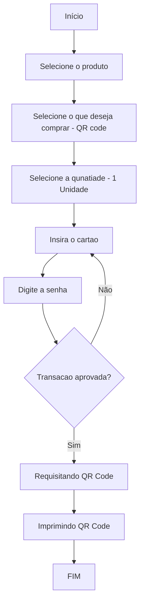
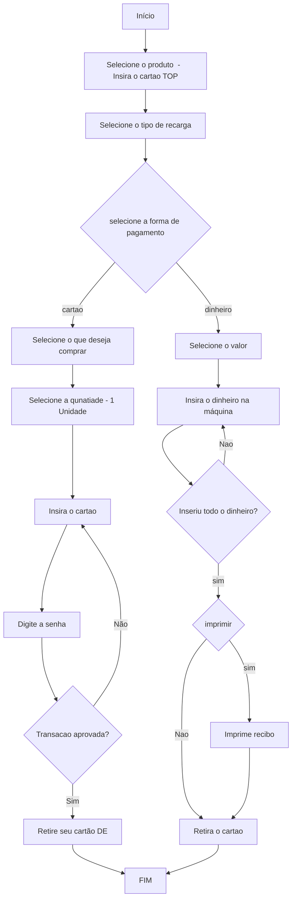

# Projeto Dual Autopass - Entrega 1


# Sobre o Projeto

Projeto desenvolvido para a ATIVIDADE 3 da disciplina Usabilidade, Desenvolvimento Web, Mobile e Jogos.

<h4 align="center"> 
	🚧  Em desenvolvimento . . .
</h4>

# Índice/Sumário

- [Sobre](#sobre-o-projeto)
- [Sumário](#índice/sumário)
- [Requisitos Funcionais](#requisitos-funcionais)
- [Tecnologias Usadas](#tecnologias-usadas)
- [Contribuição](#contribuição)
- [Autores](#autores)
- [Licença](#licença)
- [Agradecimentos](#agradecimentos)

# Entregaveis

| ID               | Categoria     | Entregável       | Descrição                                                                           | Pontos |
| ---------------- | ------------- | ---------------- | ----------------------------------------------------------------------------------- | ------ |
| 1                | Requisitos    | Fluxo de Usuário | Fluxograma ou diagrama de atividades para descrever os fluxos de tarefas do usuário | 3      |
| 2                | Requisitos    | Personas         | Descrição das personas                                                              | 4      |
| 3                | Requisitos    | Cenários         | Descrição dos cenários                                                              | 4      |
| 4                | Protótipos    | Protótipo lo-fi  | Wireframe estático                                                                  | 5      |
| 5                | Protótipos    | Protótipo hi-fi  | Protótipo Interativo                                                                | 5      |
| 6                | Avaliação     | Relatório        | Relatório analítico das heurísticas de Nielsen.                                     | 4      |
| 7                | Implementação | Aplicação Web    | Implementação das telas do protótipo desenvolvido                                   | 5      |
| 8                | Apresentação  | Link Vídeo       | apresentando sua solução de redesign                                                | 5      |
| TOTAL PROJETO A3 |               |                  |                                                                                     | 35     |

# Fluxo de Usuário
1.Compra do Bilhete Digital QR Code

2.Recarga do Cartão TOP

3.Recarga do Bilhete Único
```mermaid

```


# Descrição das personas

As imagens para as personas foram geradas aleatoriamente por inteligencia artificial e não existem,através do site: [https://this-person-does-not-exist.com/en](https://this-person-does-not-exist.com/)

 <table>
    <tr>
      <td align="center">
	  	<a href="/personas/persona1.md">
	  		
			<br />
	  			<sub>
				<b>Jose Bonifácil </b>
				</sub>
		</a>
		<br/>
	 </td>
      <td align="center">
	  	<a href="/personas/persona2.md">
	  		
			<br />
			<sub>
				<b>Maria Rita</b>
			</sub>
		</a>
		<br />
	</td>
	</tr> 
</table>

# Descrição dos cenários

# Wireframe estático

# Protótipo Interativo

# Relatório analítico das heurísticas de Nielsen.

# Implementação das telas do protótipo desenvolvido

# Vídeo apresentando sua solução de redesign

Assista a apresentação clicando [aqui](http://teste.com) .

# Requisitos Funcionais

- [x] **Cadastrar Usuário**
- [x] **Fazer Login**
- [ ] Matricular em Curso
- [ ] Cancelar Matricula
- [ ] Visualizar Notas
- [ ] Visualizar e Atualizar Informações do Estudante

# Tecnologias Usadas

- [Flutter](https://flutter.dev/)
- [Node.js](https://nodejs.org/en/)
- [React](https://pt-br.reactjs.org/)
- [React Native](https://reactnative.dev/)
- [TypeScript](https://www.typescriptlang.org/)

# Contribuição

Leia o arquivo [CONTRIBUTING.md](CONTRIBUTING.md) para saber detalhes sobre o nosso código de conduta e o processo de envio de solicitações _pull_ (_Pull Request_) para nós.

# Autores

[Exemplo](https://github.com/testing-library/react-testing-library#contributors)

# Licença

Este projeto está licenciado sob a Licença MIT, consulte o arquivo [LICENSE.md](LICENSE.md) para mais detalhes.

# Agradecimentos

Seção livre para você agradecer a todos que contribuiram para a execução do seu projeto.
